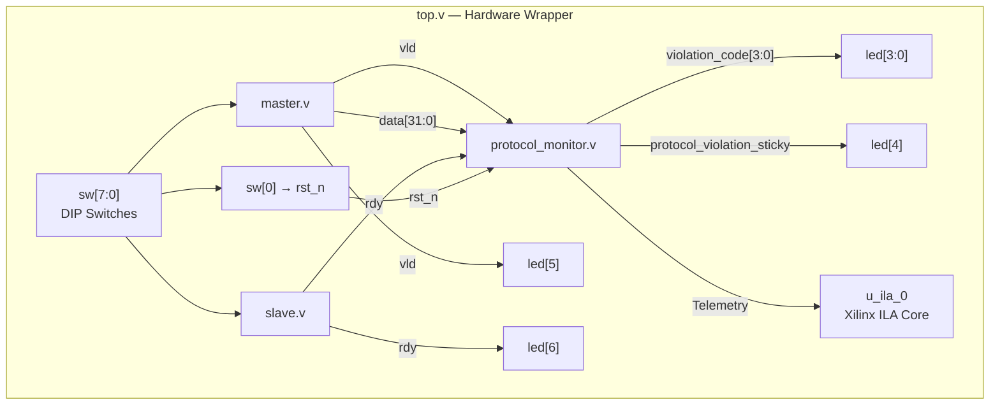

# Protocol Monitor IP

A parameterized FPGA IP core for real-time monitoring, assertion checking, and performance profiling of streaming Valid/Ready handshake protocols.

Targets the Avnet ZedBoard (`xc7z020clg484-1`) with Xilinx Vivado.

---

## 1. Project Overview

The **Protocol Monitor IP** is a passive hardware monitor for streaming data interfaces that use Valid/Ready handshake semantics. It observes control and data signals on every clock edge without inserting any logic into the monitored data path. When a protocol violation occurs, the monitor latches a sticky error flag, records a live violation code, and increments per-category error counters. It also computes cycle-accurate transaction latency (minimum, maximum, and last) and a sliding-window throughput percentage.

The design is fully parameterized and can be instantiated alongside any Valid/Ready interface for on-chip protocol verification and performance analysis.

---

## 2. Key Features

- **Passive Monitoring** — Zero pipeline latency, zero logic insertion on the monitored data path.
- **Protocol Assertion Checking** — Real-time detection of four violation types: Drop Valid, Data Change during wait, Timeout, and Reset Grace.
- **Performance Telemetry** — Cycle-accurate minimum, maximum, and last transaction latency measurement.
- **Sliding-Window Throughput** — Real-time throughput percentage over a configurable `WINDOW_SIZE` cycle history.
- **On-Chip Debug** — Integrated Xilinx ILA (`u_ila_0`) core with `mark_debug` attributes for Vivado Hardware Manager probing.
- **Self-Checking Testbench** — Automated verification with PASS/FAIL reporting and `error_count` tracking across all violation scenarios.

---

## 3. Repository Structure

```
Protocol-Monitor-IP/
├── rtl/
│   ├── protocol_monitor.v       # Core protocol checker and telemetry engine
│   ├── top.v                    # Top-level hardware wrapper with ILA debug
│   ├── master.v                 # Switch-to-valid producer mock
│   └── slave.v                  # Switch-to-ready consumer mock
├── tb/
│   └── tb.v                     # Self-checking verification testbench
├── constraints/
│   └── constraints.xdc          # ZedBoard pin assignments, clock, and ILA core
├── docs/
│   ├── architecture.md          # RTL architecture, parameters, and port reference
│   ├── protocol_rules.md        # Protocol rule specification with WaveDrom diagrams
│   ├── integration_guide.md     # Vivado build guide and instantiation examples
│   └── verification.md          # Simulation timeline and verification methodology
├── images/
│   └── README.md                # Waveform and ILA screenshot placeholders
├── scripts/
│   └── create_project.tcl       # Vivado batch project creation script
├── .github/
│   ├── ISSUE_TEMPLATE/
│   │   ├── bug_report.md
│   │   ├── feature_request.md
│   │   └── documentation.md
│   └── PULL_REQUEST_TEMPLATE.md
├── .gitignore
├── CHANGELOG.md
├── CODE_OF_CONDUCT.md
├── CONTRIBUTING.md
├── LICENSE
├── SECURITY.md
└── README.md
```

---

## 4. RTL Architecture



For full parameter and port reference tables, see [docs/architecture.md](docs/architecture.md).

---

## 5. Protocol Rules & Timing

The monitor enforces four protocol rules. Each violation sets `protocol_violation_sticky` to `1`, pulses a unique `violation_code`, and increments a per-category counter.

| Code | Name | Trigger Condition | Counter |
| :---: | :--- | :--- | :--- |
| `4'd0` | `VIOL_NONE` | No violation on current cycle | — |
| `4'd1` | `VIOL_DROP_VALID` | `vld` deasserted before handshake while `transaction_active` | `drop_valid_count` |
| `4'd2` | `VIOL_DATA_CHG` | `data` changed while waiting for `rdy` | `data_change_count` |
| `4'd3` | `VIOL_TIMEOUT` | `wait_counter >= TIMEOUT_LIMIT` | `timeout_count` |
| `4'd4` | `VIOL_RESET_VALID` | `vld` high during `reset_grace_cnt != 0` | `reset_violation_count` |

### WaveDrom: Drop Valid Violation

```json
{ "signal": [
  {"name": "clk",    "wave": "p........"},
  {"name": "vld",    "wave": "0.1.0...."},
  {"name": "rdy",    "wave": "0........"},
  {"name": "code",   "wave": "0...1.0..", "data": ["1"]},
  {"name": "sticky", "wave": "0...1...."}
]}
```

### WaveDrom: Data Change Violation

```json
{ "signal": [
  {"name": "clk",    "wave": "p........"},
  {"name": "vld",    "wave": "0.1......"},
  {"name": "rdy",    "wave": "0........"},
  {"name": "data",   "wave": "x.=.=....", "data": ["A", "B"]},
  {"name": "code",   "wave": "0...2.0..", "data": ["2"]}
]}
```

For all five WaveDrom timing diagrams including Timeout and Reset Grace, see [docs/protocol_rules.md](docs/protocol_rules.md).

---

## 6. Simulation Timeline

The self-checking testbench ([tb/tb.v](tb/tb.v)) overrides `TIMEOUT_LIMIT` to `10` for simulation and exercises five sequential scenarios:

| Time (approx.) | Scenario | Expected Observation |
| :---: | :--- | :--- |
| 50–140 ns | Scenario 0: Clean Handshake | `total_handshakes` increments to 5; `total_violations` remains 0; `violation_code` stays `0`. |
| 175–190 ns | Scenario 1: Drop Valid | `violation_code` pulses to `1`; `drop_valid_count` increments; `protocol_violation_sticky` latches to `1`. |
| 220–240 ns | Scenario 2: Data Change | `violation_code` pulses to `2`; `data_change_count` increments. |
| 350–370 ns | Scenario 3: Timeout | `violation_code` pulses to `3`; `timeout_count` increments. |
| 445–460 ns | Scenario 4: Reset Grace | Active-low reset clears all counters to zero; upon release, `violation_code` pulses to `4`; `reset_violation_count` = 1. |

**Note:** The final simulation log shows `total_handshakes = 0` and counters reflecting only Scenario 4 values because the reset in Scenario 4 clears all previously accumulated counters. This is correct behavior — active-low reset zeroes every register in `protocol_monitor`.

---

## 7. Verification

### Methodology

- **Self-Checking Assertions**: Each scenario uses `check_condition(expression, test_name)` to verify expected signal values.
- **Error Tracking**: An integer `error_count` variable tracks failed assertions. A value of `0` at `$finish` indicates all tests passed.
- **Hierarchical Signal Access**: Internal telemetry signals are accessed via hierarchical references (e.g. `uut.protocol_violation_sticky`) since they are not routed to top-level ports.

### Throughput Calculation Note

`throughput_pct` remains `0` throughout simulation. The throughput formula uses integer division over `WINDOW_SIZE = 1000` cycles. With only 5 handshakes in ~50 cycles: (5 × 100) / 1000 = 0 (integer truncation from 0.5). This is expected behavior, not a bug.

For the full simulation timeline, signal behavior notes, and waveform reading guide, see [docs/verification.md](docs/verification.md).

---

## 8. FPGA Usage & Hardware Integration

### Target Board

- **FPGA**: Xilinx Zynq-7000 (`xc7z020clg484-1`)
- **Board**: Avnet ZedBoard
- **Clock**: 100 MHz on pin Y9

### LED Mapping

| LED | Signal | Description |
| :--- | :--- | :--- |
| `led[3:0]` | `violation_code[3:0]` | Live violation code (0 = None, 1 = Drop, 2 = Data, 3 = Timeout, 4 = Reset) |
| `led[4]` | `protocol_violation_sticky` | Latched error flag (1 if any violation since reset) |
| `led[5]` | `vld` | Live Valid signal state |
| `led[6]` | `rdy` | Live Ready signal state |
| `led[7]` | `vld & rdy` | Live Handshake indicator |

### Switch Mapping

| Switch | Function |
| :--- | :--- |
| `sw[0]` | Active-low reset (`rst_n`) |
| `sw[1]` | Valid (`vld`) |
| `sw[2]` | Ready (`rdy`) |
| `sw[7:3]` | Data payload (5 bits, zero-padded to 32 bits) |

### Quick Start

```bash
vivado -mode batch -source scripts/create_project.tcl
```

For instantiation examples and ILA debug setup, see [docs/integration_guide.md](docs/integration_guide.md).

---

## 9. Verification Results

### Expected Simulation Log Output

```
==================================================
   STARTING PROTOCOL MONITOR IP SELF-TESTBENCH
==================================================

--- Running Scenario 0: Normal Handshake Operations ---
[PASS] ... - Test Passed: Scenario 0: 5 Normal Handshakes Counted
[PASS] ... - Test Passed: Scenario 0: Zero Violations in Normal Handshakes

--- Running Scenario 1: DROP_VALID Violation ---
[PASS] ... - Test Passed: Scenario 1: Live Violation Code 1 (DROP_VALID)
[PASS] ... - Test Passed: Scenario 1: Sticky Violation Latched
[PASS] ... - Test Passed: Scenario 1: Drop Valid Counter Incremented

--- Running Scenario 2: DATA_CHANGE Violation ---
[PASS] ... - Test Passed: Scenario 2: Live Violation Code 2 (DATA_CHANGE)
[PASS] ... - Test Passed: Scenario 2: Data Change Counter Incremented

--- Running Scenario 3: TIMEOUT Violation ---
[PASS] ... - Test Passed: Scenario 3: Timeout Counter Incremented

--- Running Scenario 4: RESET Grace Violation ---
[PASS] ... - Test Passed: Scenario 4: Live Violation Code 4 (RESET_VALID)
[PASS] ... - Test Passed: Scenario 4: Reset Violation Counter Incremented

==================================================
   *** ALL VERIFICATION TESTS PASSED (0 ERRORS) ***
   Total Handshakes : 0
   Total Violations : 1
   Drop Valid Count : 0
   Data Change Count: 0
   Timeout Count    : 0
   Reset Violations : 1
==================================================
```

> **Note:** Final summary counters show post-reset values only. Scenario 4 asserts active-low reset, which clears all counters to zero. After reset release, only the Reset Grace violation is recorded.

### Waveform Screenshots

*Screenshots not yet captured. Add the following images to the `images/` directory:*

- `images/waveform_clean_handshake.png` — Normal handshake sequence
- `images/waveform_drop_valid.png` — Drop Valid violation
- `images/waveform_data_change.png` — Data Change violation
- `images/waveform_timeout.png` — Timeout violation
- `images/waveform_reset_violation.png` — Reset Grace violation
- `images/ila_hardware_debug.png` — ILA hardware capture

---

## 10. Future Work

1. **Timing Optimization** — Replace `WINDOW_SIZE = 1000` with `1024` and use bit-shift (`>> 10`) instead of integer division (`/ 1000`).
2. **Runtime Error Clear** — Add a `clear_error` input port to deassert `protocol_violation_sticky` without full chip reset.
3. **AXI4-Lite Register Interface** — Wrap telemetry registers into an AXI4-Lite slave for CPU memory-mapped access.
4. **CI/CD** — Add a GitHub Actions workflow running Icarus Verilog simulation and automated PASS/FAIL gate.

---

## 11. License

This project is released under the [MIT License](LICENSE).
