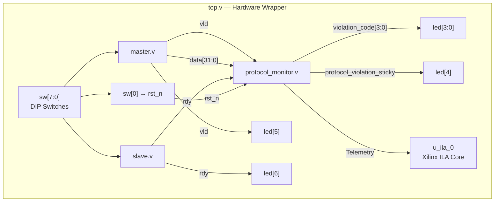

# RTL Architecture Specification

## 1. Overview

The **Protocol Monitor IP** is a parameterized, passive hardware IP core for real-time monitoring of streaming Valid/Ready handshake protocols. It inspects control and data lines on every clock edge, detects protocol violations, latches sticky error flags, and computes cycle-accurate performance telemetry including minimum, maximum, and last transaction latency alongside sliding-window throughput percentage.

---

## 2. Module Hierarchy

```
top (top.v)
├── master (master.v)        — Combinational: sw[7:3] → data[31:0], sw[1] → vld
├── slave (slave.v)          — Combinational: sw[2] → rdy
└── protocol_monitor (protocol_monitor.v)
                             — Sequential: clk/rst_n driven assertion checker
                               and performance telemetry engine
```

### Block Diagram

```
+-----------------------------------------------------------------------------------+
|                                      top                                          |
|                                    (top.v)                                        |
|                                                                                   |
|  +--------------------+      vld, data    +------------------------------------+  |
|  |       master       |----------------->|                                    |  |
|  |     (master.v)     |                   |                                    |  |
|  +--------------------+                   |          protocol_monitor          |  |
|            ^                              |        (protocol_monitor.v)        |  |
|            |                              |                                    |  |
|  +--------------------+        rdy        |                                    |  |
|  |       slave        |----------------->|                                    |  |
|  |      (slave.v)     |                   +------------------------------------+  |
|  +--------------------+                                      |                    |
|            ^                                                 | Telemetry &        |
|            |                                                 | Violation Status   |
|   sw[7:0]  |                                                 v                    |
|  ==========+=============================================> [led[7:0]]             |
|                                                            [u_ila_0 Debug Core]   |
+-----------------------------------------------------------------------------------+
```

### System Architecture (Mermaid)



---

## 3. Parameter Reference

| Parameter | Default | Description |
| :--- | :---: | :--- |
| `DATA_WIDTH` | `32` | Bit-width of the streaming `data` bus. |
| `COUNTER_W` | `32` | Bit-width of all internal counters and latency registers. |
| `TIMEOUT_LIMIT` | `100000000` | Maximum clock cycles an un-handshaked transaction may wait before a timeout violation. At 100 MHz, this equals 1 second. |
| `WINDOW_SIZE` | `1000` | Depth of the sliding-window shift register for throughput calculation. |
| `RESET_GRACE_CYCLES` | `3` | Number of clock cycles after reset release during which `vld` must remain low. |

---

## 4. Port Reference — `protocol_monitor`

| Port | Dir | Width | Description |
| :--- | :---: | :---: | :--- |
| `clk` | In | 1 | System clock (100 MHz target). |
| `rst_n` | In | 1 | Active-low asynchronous reset. |
| `vld` | In | 1 | Monitored Valid signal from producer. |
| `rdy` | In | 1 | Monitored Ready signal from consumer. |
| `data` | In | `DATA_WIDTH` | Monitored data payload bus. |
| `protocol_violation_sticky` | Out | 1 | Latched sticky error flag. Holds `1` after any violation until reset. |
| `violation_code` | Out | 4 | Live violation code on current cycle: `0` = None, `1` = Drop Valid, `2` = Data Change, `3` = Timeout, `4` = Reset Grace. |
| `total_violations` | Out | `COUNTER_W` | Cumulative count of all protocol violations. |
| `total_handshakes` | Out | `COUNTER_W` | Cumulative count of successful handshakes (`vld && rdy`). |
| `latency_last` | Out | `COUNTER_W` | Wait duration (cycles) of the most recent completed transaction. |
| `latency_min` | Out | `COUNTER_W` | Minimum observed transaction latency since reset. |
| `latency_max` | Out | `COUNTER_W` | Maximum observed transaction latency since reset. |
| `window_handshakes` | Out | `COUNTER_W` | Handshake count within the current `WINDOW_SIZE` cycle window. |
| `throughput_pct` | Out | `COUNTER_W` | Sliding-window throughput percentage (0–100). |
| `drop_valid_count` | Out | `COUNTER_W` | Cumulative Drop Valid violations. |
| `data_change_count` | Out | `COUNTER_W` | Cumulative Data Change violations. |
| `timeout_count` | Out | `COUNTER_W` | Cumulative Timeout violations. |
| `reset_violation_count` | Out | `COUNTER_W` | Cumulative Reset Grace violations. |

---

## 5. Performance Telemetry Architecture

### Latency Measurement

Latency is measured as the number of clock cycles a transaction waits for `rdy` after `vld` has been asserted:

- `wait_counter` increments each cycle where `transaction_active == 1` and `rdy == 0`.
- `latency_last` captures the `wait_counter` value when the handshake completes (`vld && rdy`).
- `latency_min` and `latency_max` are updated on every completed handshake using comparator logic.

### Throughput Calculation

- A `WINDOW_SIZE`-bit shift register (`handshake_hist`) records whether a handshake occurred on each cycle.
- `window_handshakes` tracks the running count: it increments when a new handshake enters bit 0 and decrements when an old handshake exits bit `WINDOW_SIZE-1`.
- `throughput_pct = (window_handshakes × 100) / WINDOW_SIZE`.

> **Design Note:** The division by `WINDOW_SIZE` uses hardware integer division. For improved timing closure, a future revision could use `WINDOW_SIZE = 1024` with a bit-shift (`>> 10`).
